# Backend Class Diagrams
## AI Companion for Computer Science Education

---

## 1. Database Models (SQLAlchemy ORM)

### Core Data Entities

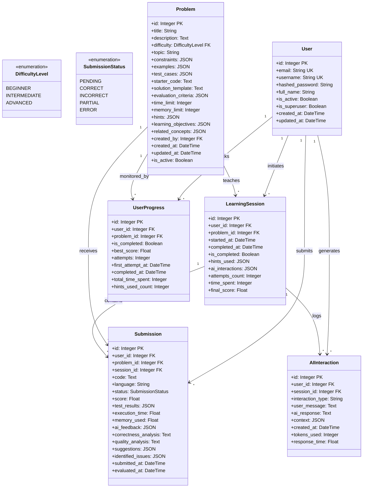

**Legend for DB Diagrams:**
- `PK` = Primary Key
- `FK` = Foreign Key  
- `UK` = Unique Key
- `*` = One-to-Many relationship

---

## 1.5 Entity-Relationship (ER) Diagram

### Complete Database Schema

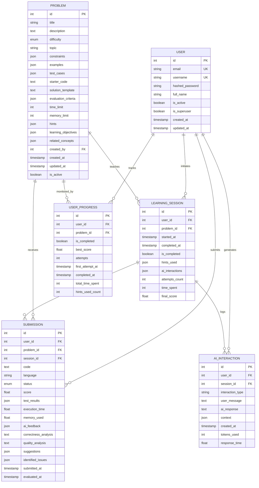

### ER Diagram Explanation

**Entities & Attributes:**
- **USER**: Stores student and instructor account information
- **PROBLEM**: Contains programming problem definitions and specifications
- **SUBMISSION**: Tracks code submissions with evaluation results
- **LEARNING_SESSION**: Represents a user's problem-solving session
- **USER_PROGRESS**: Aggregates performance metrics per user-problem pair
- **AI_INTERACTION**: Logs all AI assistance interactions

**Relationships:**
| Relationship | Cardinality | Description |
|--------------|-------------|-------------|
| USER → SUBMISSION | 1:N | One user can submit multiple solutions |
| USER → LEARNING_SESSION | 1:N | One user can have multiple sessions |
| USER → USER_PROGRESS | 1:N | One user tracks progress on multiple problems |
| USER → AI_INTERACTION | 1:N | One user generates multiple AI interactions |
| PROBLEM → SUBMISSION | 1:N | One problem receives multiple submissions |
| PROBLEM → LEARNING_SESSION | 1:N | One problem can be solved in multiple sessions |
| PROBLEM → USER_PROGRESS | 1:N | One problem tracked across multiple users |
| LEARNING_SESSION → SUBMISSION | 1:N | One session contains multiple submissions |
| LEARNING_SESSION → AI_INTERACTION | 1:N | One session logs multiple AI interactions |

---

## 2. API Request/Response Schemas (Pydantic)

### User Management Schemas

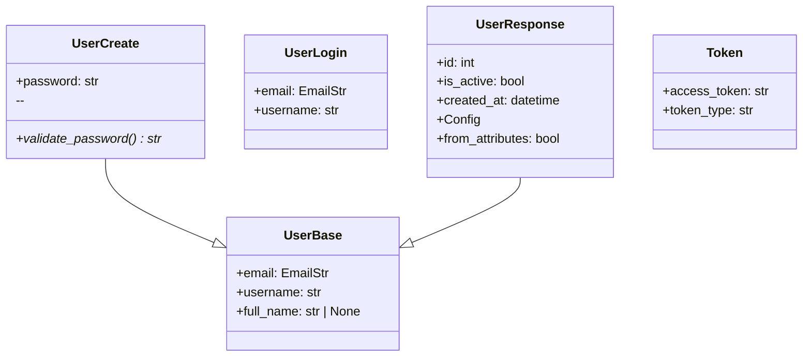

### Problem Management Schemas

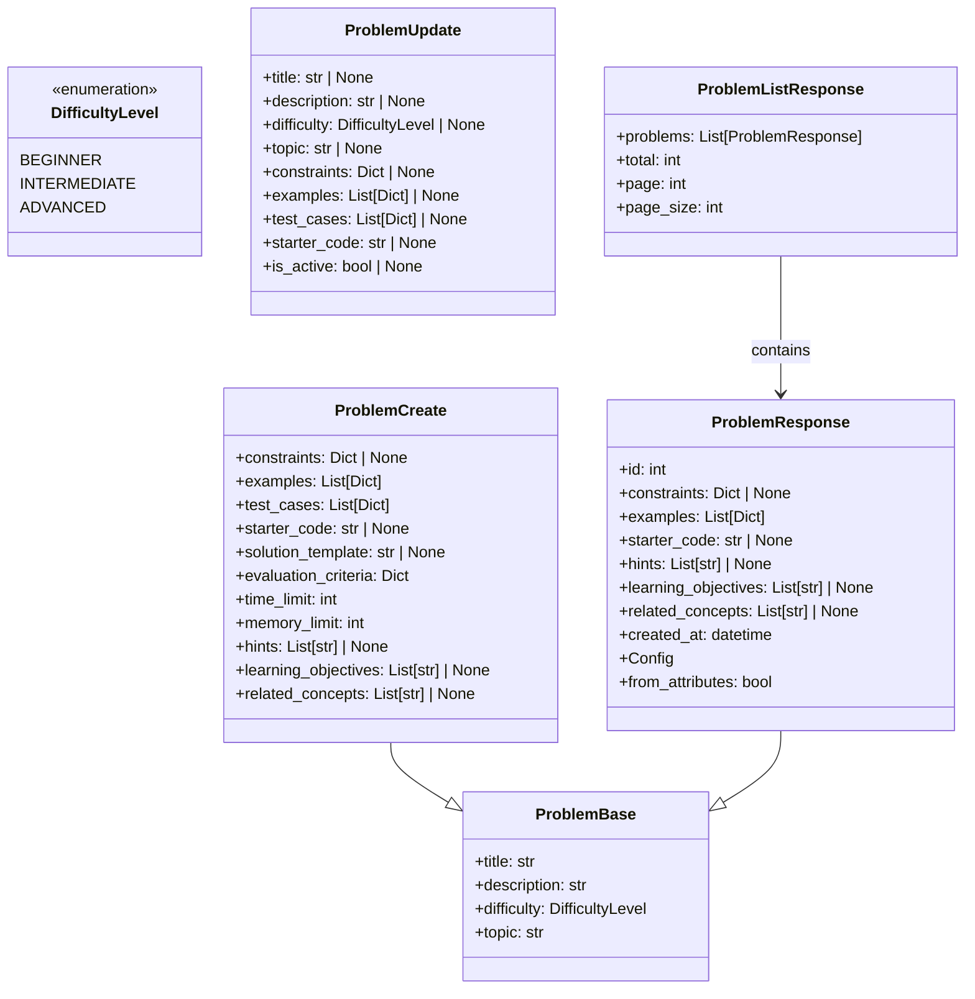

### Submission & Evaluation Schemas

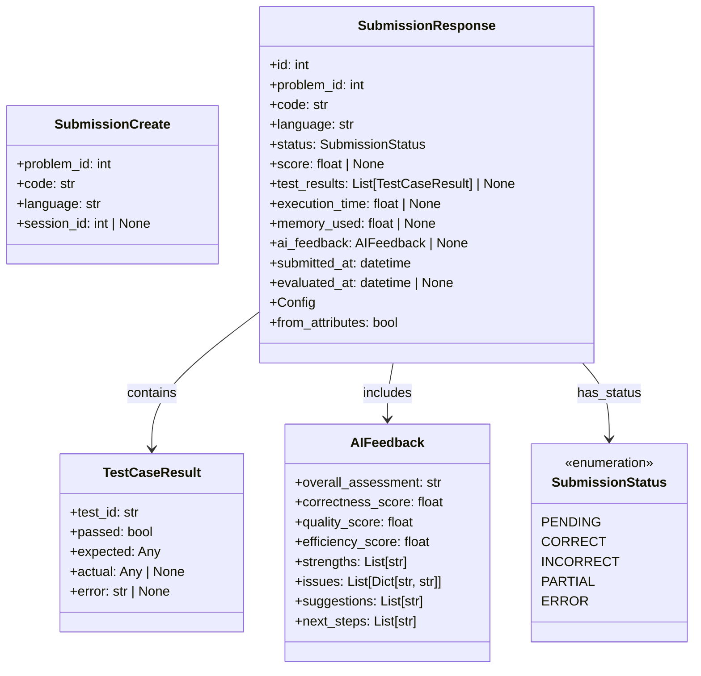

### Session & Progress Schemas

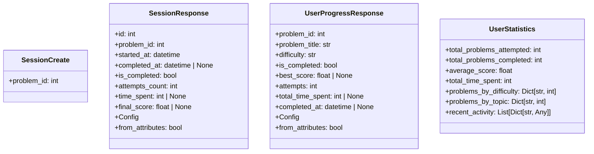

### AI Interaction Schemas

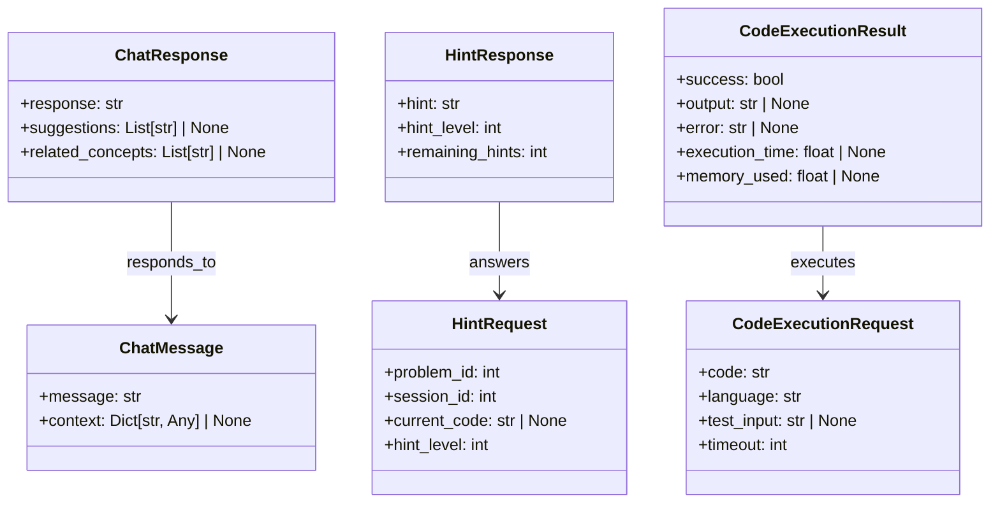

### Problem Generation Schemas

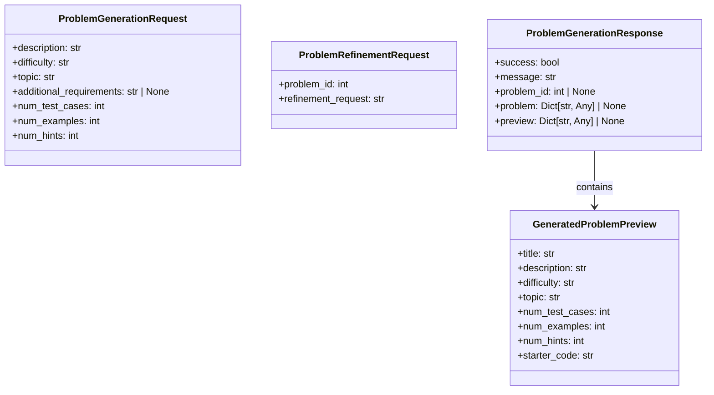

---

## 3. Service Layer Classes

### AI Service

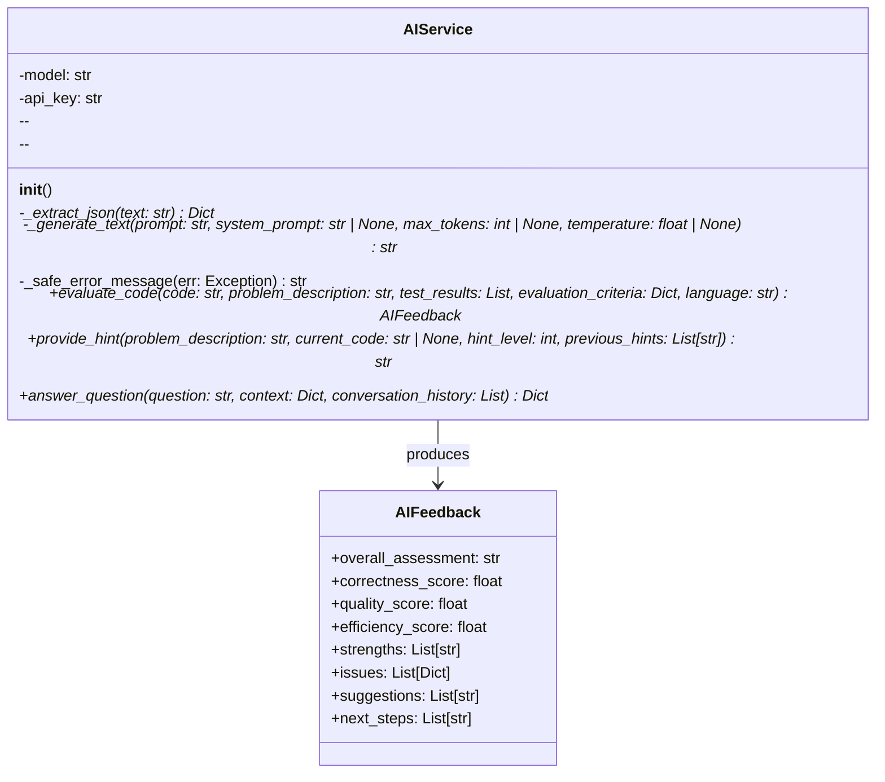

### Code Executor Service

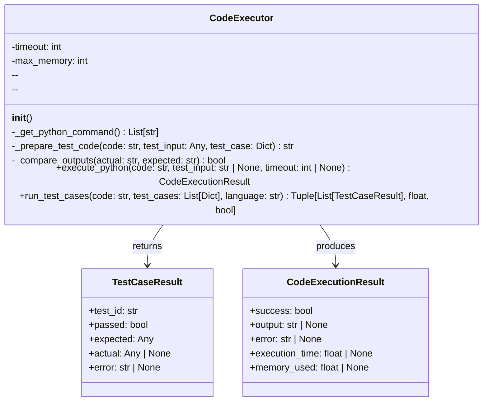

### Problem Generator Service

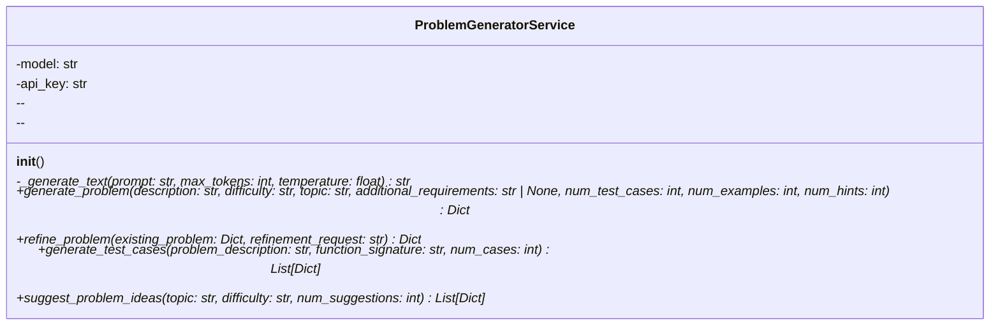

### Configuration Service

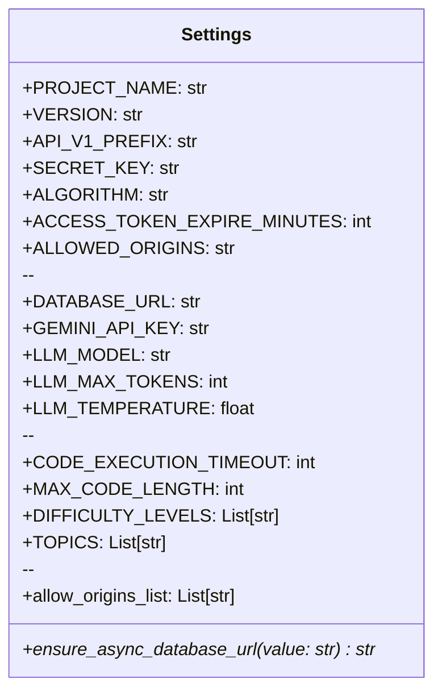

---

## 4. Complete System Architecture Diagram

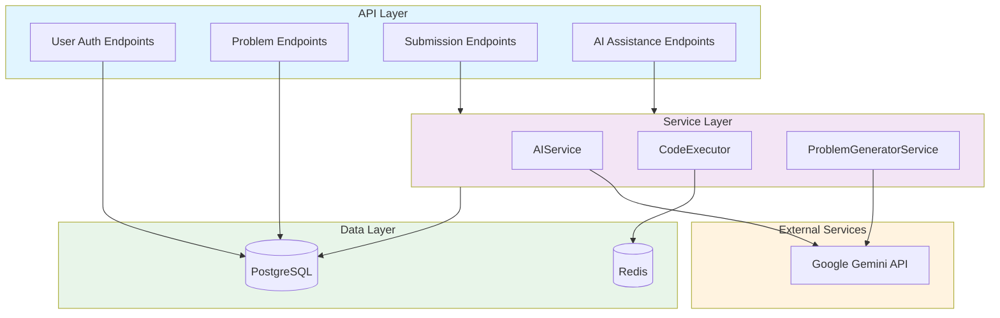

---

## Symbol Legend

### Visibility Modifiers
| Symbol | Meaning |
|--------|---------|
| `+` | Public (accessible from outside) |
| `-` | Private (internal only) |
| `#` | Protected (accessible by inheritance) |

### Method Notation
| Symbol | Meaning |
|--------|---------|
| `*` (asterisk) | Async method (coroutine) |
| `()` | Method signature with parameters and return type |
| `--` | Separator between attributes and methods |

### Type Notation
| Pattern | Meaning |
|---------|---------|
| `Type | None` | Optional type (nullable) |
| `List[T]` | List of elements of type T |
| `Dict[K, V]` | Dictionary with key type K, value type V |
| `Tuple[T1, T2]` | Tuple with specific element types |
| `Any` | Any type (flexible) |

### Relationship Types
| Arrow | Meaning |
|-------|---------|
| `-->` | Dependency/Uses (one-way) |
| `--|>` | Inheritance/Extends |
| `"1"` | One-to-one relationship |
| `"*"` | One-to-many relationship |

---

## Key Design Patterns

### MVC-like Architecture
- **Models**: SQLAlchemy ORM classes define database schema
- **Schemas**: Pydantic models handle validation and serialization
- **Services**: Business logic and external integrations

### API Request/Response Flow
1. Client sends request with Pydantic schema
2. FastAPI validates and deserializes
3. Service processes business logic
4. Response serialized back through Pydantic schema
5. Returned as JSON to client

### Database Relationships
- **User** is the central entity
- **Problem** contains educational content
- **Submission** links User to Problem with evaluation results
- **LearningSession** tracks user's problem-solving journey
- **UserProgress** aggregates performance metrics
- **AIInteraction** logs AI assistance usage

---

## Source Files Reference

| Component | File |
|-----------|------|
| Database Models | `Backend/app/models/models.py` |
| User Schemas | `Backend/app/schemas/schemas.py` |
| Problem Schemas | `Backend/app/schemas/schemas.py` |
| Problem Generation | `Backend/app/schemas/problem_generation.py` |
| AI Service | `Backend/app/services/ai_service.py` |
| Code Executor | `Backend/app/services/code_executor.py` |
| Problem Generator | `Backend/app/services/problem_generator.py` |
| Configuration | `Backend/app/core/config.py` |
